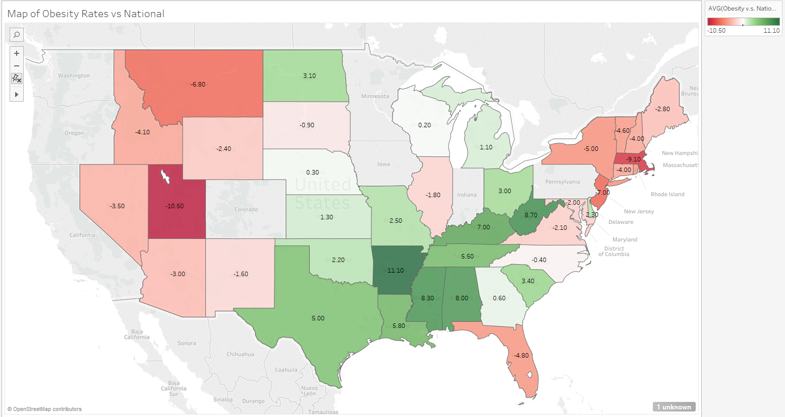
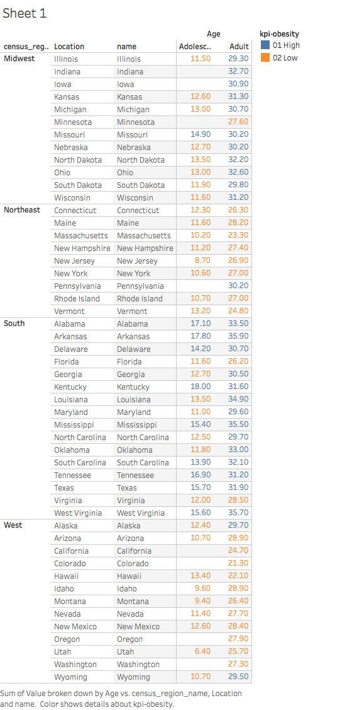
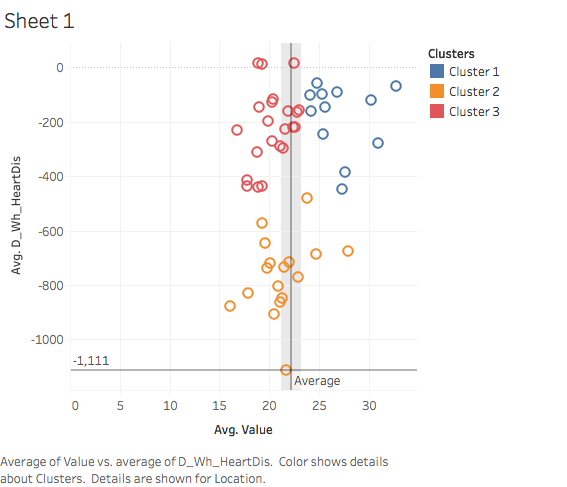
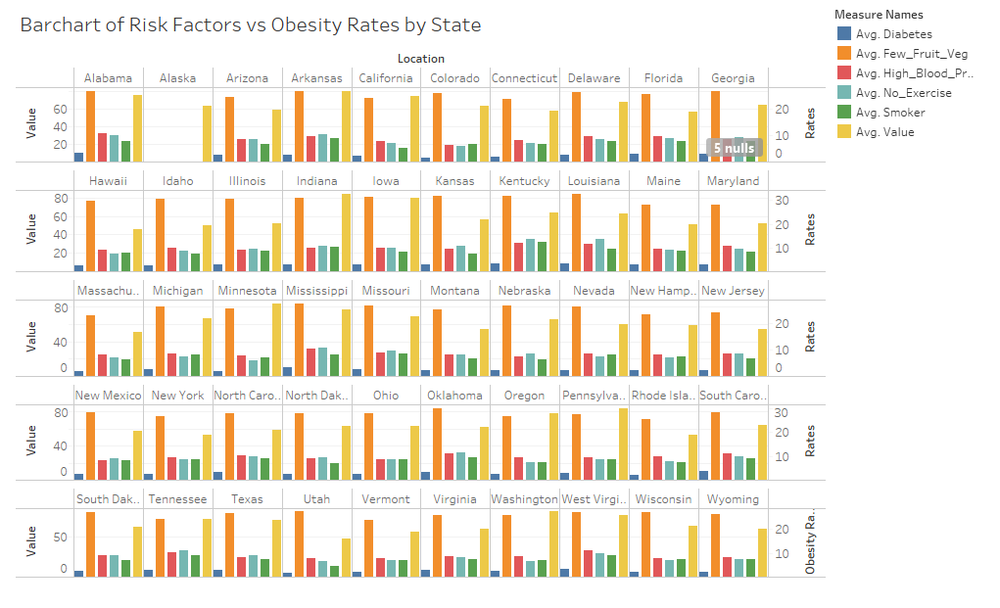
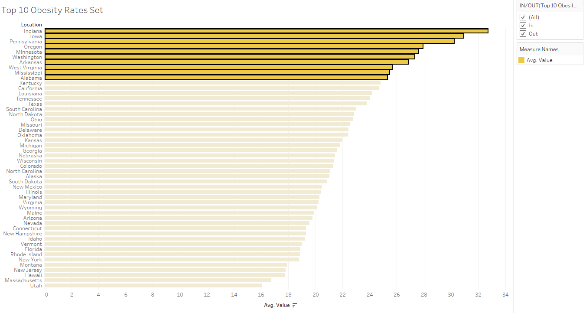
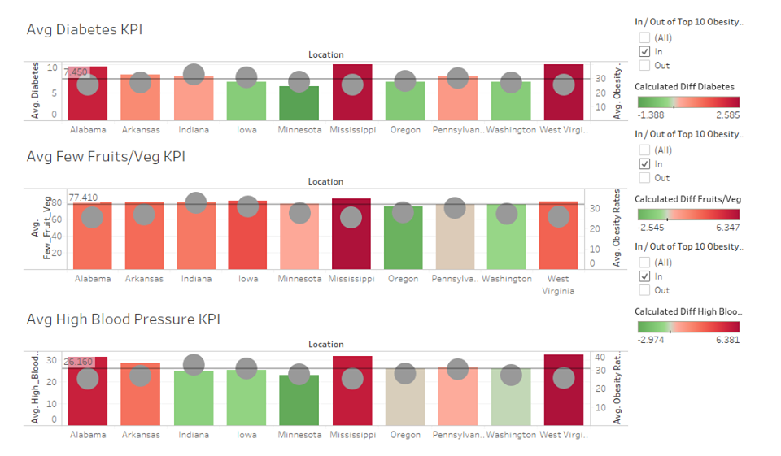
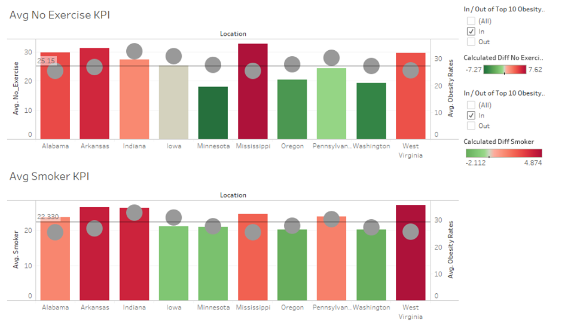

#**Introduction**
This is our R Notebook used to show how to detailing the 3 Tableau visualizations and a Shiny publication of obesity data in the United States. The dataset was retrieved through data.world and cleaned up using an ETL script that we built. This includes our instructions on how to access the data as well as our process of creating the 3 visualizations and Shiny publication from the data set in question.

#**R Configuration**
Below, we display our sessionInfo().

```{r source}
sessionInfo(package=NULL)
```

#**Data Background**
The data displayed represents the data grabbed from the "Obesity by State in 2014" dataset from Data.world (https://data.world/health/obesity-by-state-2014). The data was originally 2 separate tables containing adult obesity rates and adolescent obesity rates. The two tables were cleaned-up using ETL scripts that we built for this project. Then the 2 tables were merged into 1 using a union. Here is the ETL Script that we created.

```{r}
source("../01 Data/adolescent obesity ETL.R")
```

```{r}
source("../01 Data/adult obesity ETL.R")
```
We also utilized joins to make the visualizations more interesting. We used a state table that divided up the different states into regions (https://data.world/markmarkoh/us-state-table), the US Census data for population (https://data.world/uscensusbureau/acs-2015-5-e-agesex), and Community Health Status Indicator (CHSI) data (https://data.world/health/chsi-to-combat-obesity). The ETL scripts for those data sets are below.

```{r}
source("../01 Data/statetable ETL.R")
```

```{r}
source("../01 Data/population_byage ETL.R")
```

```{r}
source("../01 Data/heartdisease ETL.R")
```

```{r}
source("../01 Data/RiskFactors ETL.R")
```
#**Downloading the Data File**
The cleaned up data file is hosted on Data.World. You can access it by going to this web address: https://data.world/christinalien/s-17-dv-final-project. Next, click the download button in the upper right hand corner of the screen. Download the file into a CSVs folder at the same level as the project folder. The file will download as a compressed (zipped) file containing a .csv file. Unzip the package, rename the csv to PreETL_adultobese.csv and PreETL_adolescentobese.csv and you should have the data file ready to go, just run the ETL.r script and it should clean up the data. Next, the cleaned up data was uploaded back into data.world and, using the query editor, we created a new column 'Age' that displayed Adult for the adult data and Adolescent for the adolescent data. Then, we combined the two tables using a union, downloaded the results to a csv, and uploaded the final result of the table as "Adult_Adolescent_Obesity.csv".

#**Data Visualization Introduction**
Initially, we visualized the adolescent and adult obesity rate data from 2013 using boxplots. Next, we used joins with the state table and CHSI datasets to create more interesting relationships and visualizations.

#**Tableau Data Visualization 1** 
 

The first visualization shows us the national average of obesity rates per age group (Adolescent and Adult). While the boxplot shows the averages, we wanted the viewer to be able to see the states that have high or low rates compared to the national average. This is why there is a combination of a scatterplot and boxplot in the shiny visualization. 

The boxplot shows us that, on average, the Adolescents age group has a significantly lower rate than the national Adult average of obesity. While the Adolescent average obesity rate is only 12.9, the Adult group has more than double the rate at 29.4. Furthermore, through the shiny app, we are able to see that states with low Adolescent rates, Utah, have low Adult rates. This trend can also be seen in the high percentages for both groups (i.e. Arkansas). 

#**Tableau Data Visualization 2** 


This Tableau visualization is a map that depicts the average adolescent and adult obesity rates for each state. We created this map by first selecting 'Location' as a mapping variable. Then, we created 2 calculated fields, 'Adolescent Obesity vs National' and 'Adult Obesity vs National', that calculated the difference between the state value of obesity and the national value. Then, we created another calculated field that added the 'Adolescent Obesity vs National' and 'Adult Obesity vs National' fields together, and named it 'Obesity vs National'. This value was put into the map as both the color and the label fields. In the map, states that are more red have more of low rate of obesity from the national rate. States that are more green have more of a high rate of obesity from the national rate. 

One interesting observation that we noticed from the map was that **states on the east and west coasts tended to have lower rates of obesity**. Meanwhile, **central states like Texas and Louisiana tended to have higher rates of obesity** compared to the national rate. 

#**Tableau Data Visualization 3** 


In this visualization, we analyzed the obesity rate by state and then grouped that information by region, the interesting information we gleaned from this visualization is **that the South and Midwest have a much higher rate of obesity than the East or West**. This indicates a significant difference in lifestyle choices or opportunities in the United States and presents a very interesting question on what it is exactly that causes the states in the South and Midwest to be so "unhealthy". In addition, we found that while the South was above the national average for both adolescents and adults, for the most part, the Midwest's adults were the only ones that were more obese than the national average. This could perhaps mean that **the youth in the Midwest are adopting healthier lifestyles** or it could mean something else, but it poses the question nonetheless.

We created this visualization by joining the statetable to the Adult_Adolescent_Obesity table and then creating a crosstab using state, region as the dimensions;and we used the Value, or rate of obesity as the value. We created a KPI calculated field that measured whether or not the value of a particular state was greater or lower than the national average based on whether or not the field in question was adult or adolescent.

#**Tableau Data Visualization 4** 
 

This visualization is great at showing correlations between two measures. In this case, we wanted to analyze the correlation between heart disease deaths and obesity by state. The **interesting visualiation that we discovered here was that death caused by heart disease and obesity have a mildly positive correlation**. One thing to note however is the heart disease numbers, they are incredibly different from the obesity rates. While we are not 100% confident at their meaning, looking at the readme of the dataset we pulled this from, https://data.world/health/chsi-to-combat-obesity, that they are indeed percentages that record the rate of deaths from heart disease, therefore while the individual meaning may be lost on us, the spread of the data is what is important, and that can be measured against obesity rates.

We created this visualization by joining the leadingCOD table to the adult_adolescent_obesity tables by state, then pitting heart disease death rate against obesity rates in the individual states. On tableau we utilized an analytic tool called clusters that showed three distinct groupings, unfortunately we could not discover anything interesting from this but we believe it to show a good understanding of course material.


#**Tableau Data Visualization 5** 
 

The histogram of Fruits/Veggies shows us that the average bin ranges from 80 to 90 with the highest count being 168. With the visualization, we can see that the probability that a state has malnutrition from lack of fruits and vegetables is fairly high and may play a part in obesity rates.

#**Tableau Data Visualization 6** 
 

By producing the calculated field of (([CI_Max_Fruit_Veg]/100)/100)*[totalpop], we were able to apply the states to the field and create a visualization that shows us how much of each state's population were getting low amounts of fruits and vegetables in their diet. The visualization not only tells us the population number, but also visually represents the highest populations of malnutrition.

The visualization points out that the trends seen from the boxplot cannot fully be reflected in the malnutrition data. For example, Texas is on the higher end of obesity rates compared to the national average (as seen by the boxplot) and also boasts one of the largest populations of malnutrition. However, the states California, New York, and Florida have high populations of malnutrition, but still remain lower than the national average in terms of obesity.

#**Tableau Data Visualization 7** 


This Trellis Bar Chart utilizes a join of the Adult_Adolescent_Obesity data and the RiskFactors data on Location=CHSI_State_Name. It depicts each state's risk factor rate and obesity rate. This visualization tells us each state compares in terms of diabetes rate, rate of few fruits/vegetables, rate of high blood pressure, rate of not exercising, smoking rate, and obesity rate.

While this visualization is interesting, it is overwhelming in how much information it conveys. It is not easy for the viewer to draw instant conclusions about the data like in other visualizations. In order to more easily ascertain a relationship between obesity rates and risk factors, we created a set of 10 states that had an obesity rate of 25% or higher. 



This visualization depicts how the set was created for the state with the highest obesity rates.


#**Tableau Data Visualization 8** 

 


 

These visualizations utilize the set created previously to compare obesity rates with risk factor data. In these visualizations, it's interesting that **obesity rates are not correlated with risk factors** as much as we though they would be. For instance, Alabama, Mississippi, and West Virgina consistently have high risk factor rates (are shown in the bars as being dark red), but have about average obesity rates (shown by the grey dot). Meanwhile, states like Minnesota, Oregon, and Washington have higher obesity rates, but lower risk factor rates.

#**Shiny Publication**

https://bkim.shinyapps.io/finalproject/

In our Shiny publication, we have replicated the Tableau visualizations using R Code. The Shiny app can be accessed through the link above.

#**Conclusion**
Thanks for showing an interest in our work, we hope you enjoyed the ways we decided to visualize obesity data throughout different slices of the United States.